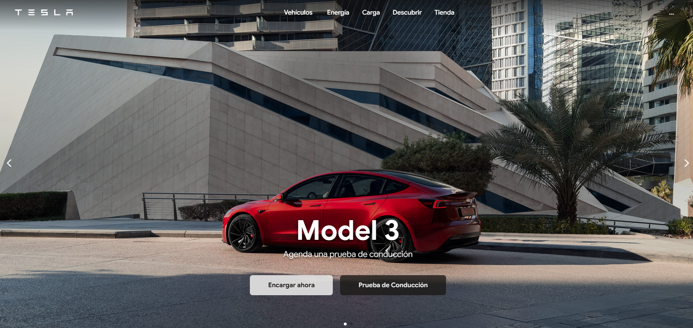

# 🚗 Clon de la Página de Inicio de Tesla

Clon visualmente fiel y completamente responsivo de la página de inicio de Tesla, desarrollado para demostrar habilidades avanzadas de maquetación front-end con un enfoque en la interactividad y el diseño limpio. Este proyecto recrea múltiples secciones complejas, desde menús desplegables dinámicos hasta un mapa interactivo.

**🚀 Ver Demo en Vivo:** [**Clon de la pagina web**](https://tesla-clone-lilac-six.vercel.app/) <br/>
**🚀Ver original:** [**Pagina web Tesla Original**](https://www.tesla.com/es_ES?redirect=no)



---

### ✨ Características Principales

- **Diseño 100% Responsivo:** Adaptado meticulosamente para una experiencia de usuario óptima en móviles, tablets y escritorio.
- **Header Dinámico y Menús Desplegables:**
  - La cabecera cambia de transparente a un fondo oscuro al hacer scroll.
  - Múltiples mega-menús interactivos para "Vehículos", "Energía", "Carga" y "Tienda", implementados con **Alpine.js** para un manejo de estado limpio y declarativo.
- **Carruseles Interactivos con Swiper.js:**
  - Un carrusel principal a pantalla completa (`hero slider`).
  - Un carrusel secundario para mostrar los modelos de vehículos, con configuración responsiva para mostrar múltiples tarjetas.
- **Mapa Interactivo con Leaflet.js:**
  - Sección de mapa funcional que muestra puntos de carga.
  - Utiliza una capa de mapa (tiles) de CARTO para un estilo minimalista.
- **Maquetación Avanzada con Tailwind CSS:**
  - Uso extensivo de **Flexbox** y **CSS Grid** para recrear layouts complejos.
  - Diseño de componentes como tarjetas interactivas y secciones a pantalla completa.
- **Microinteracciones y Efectos Visuales:**
  - Transiciones y efectos `hover` sutiles en tarjetas, botones y menús para una experiencia de usuario más pulida y profesional.
  - Animaciones de entrada para el contenido, como `fade-in-up`.

---

### 💻 Tecnologías Utilizadas

- **HTML5:** Para la estructura semántica del contenido.
- **Tailwind CSS:** Como framework principal para un desarrollo rápido y un diseño consistente.
- **JavaScript (ES6+):** Para la lógica de la aplicación.
- **Alpine.js:** Para la interactividad de los menús desplegables y el manejo de estado en el DOM.
- **Swiper.js:** Para la creación de carruseles táctiles y responsivos.
- **Leaflet.js:** Para la implementación del mapa interactivo de cargadores.

---

### 🛠️ Instalación y Uso

Para ejecutar este proyecto localmente, simplemente abre el archivo `index.html` en tu navegador de preferencia.

```bash
# No se requiere instalación, solo abrir el archivo HTML.
# Todas las dependencias se cargan a través de un CDN.
```
